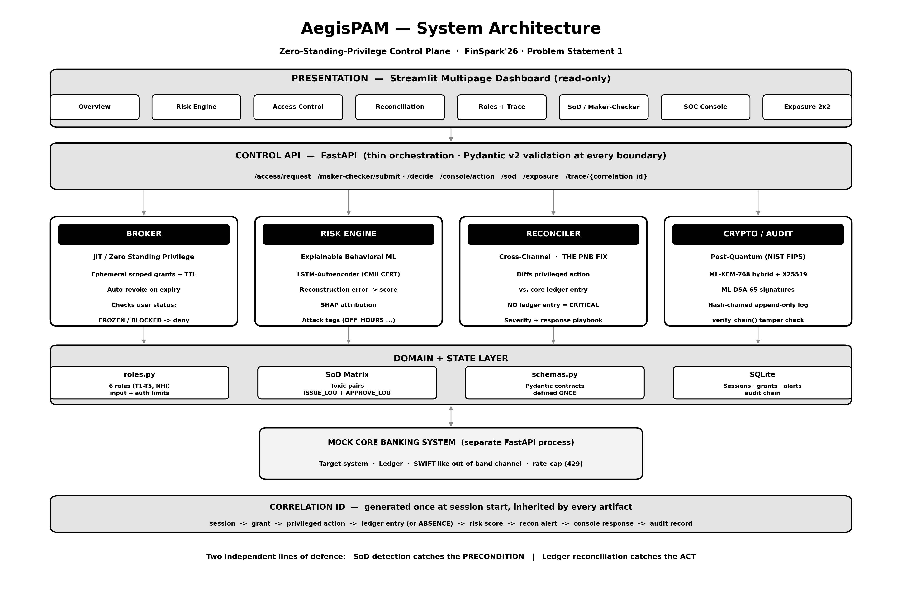

<p align="center">
  
</p>

# AstraPAM

**Zero-Standing-Privilege control plane for Indian banks.**

> Catches the insider fraud that behavioral analytics is structurally blind to — the exact gap that enabled the ₹14,000 Cr PNB fraud.

---

## Live Demo

| App | What it does | Link |
|---|---|---|
| **AstraPAM Dashboard** (Streamlit) | The security control plane — monitor risk scores, access grants, audit logs, SoD violations, and reconciliation alerts in real time | https://astrapam.streamlit.app/ |
| **CBS Simulation** — Core Banking System (Next.js) | A simulated bank teller portal where employees log in and perform transactions — AstraPAM intercepts every action and decides allow / throttle / deny | https://cbs-simulation.vercel.app/ |

---

## The Problem

In 2018, two PNB employees issued fraudulent LoUs worth ₹14,000 Cr over seven years. No anomaly detector fired — because the transactions *looked normal*. The fraud signature was an **absence**: a SWIFT action with no matching core ledger entry, by a user who held both `ISSUE_LOU` and `APPROVE_LOU` on a single identity.

Every existing PAM, UEBA, and SWIFT control was looking at the transaction. None was looking for the transaction that wasn't there.

---

## What AstraPAM Does

| Control | What it catches |
|---|---|
| **SoD Detection** | Flags `ISSUE_LOU + APPROVE_LOU` on one identity *before* any fraud occurs (`SOD-001 CRITICAL`) |
| **Ledger Reconciliation** | Diffs every privileged action against CBS — no entry within SLA → severity-tiered alert |
| **JIT Access + ZSP** | No standing privilege. Every grant is ephemeral, scoped, TTL-bound, risk-gated |
| **Behavioral Risk Engine** | LSTM Autoencoder (CMU CERT dataset) + SHAP attribution — every score is auditable |
| **Blind-Spot Quadrant** | Behavioral Risk × Standing Exposure — surfaces users who look safe but carry structural danger |
| **Post-Quantum Crypto** | ML-KEM-768 + ML-DSA-65 on a hash-chained audit log (NIST FIPS 203/204) |

---

## Stack

`FastAPI` · `PyTorch` · `SHAP` · `Streamlit` · `SQLite` · `pqcrypto` · `NVIDIA NIM`

---

## Quickstart

```bash
git clone https://github.com/smilewithkhushi/AstraPAM
cd AstraPAM
python -m venv .venv && source .venv/bin/activate
pip install -r requirements.txt
cp .env.example .env   # optional: set NVIDIA_NIM_API_KEY for PDF reports
./script.sh            # starts CBS mock, API, and dashboard
```

Open **http://localhost:8501**

---

## Demo Path — "The Gokulnath Shetty Trace"

1. **Page 1 (SoD)** — `user_007` holds `ISSUE_LOU + APPROVE_LOU` → `SOD-001 CRITICAL` raised immediately
2. **Page 2 (Access Control)** — JIT request for `lou_issuance_system` at 02:14 → DENY
3. **Page 3 (Reconciliation)** — privileged action fires, no CBS entry → CRITICAL alert
4. **Page 4 (Risk Engine)** — risk `0.87`, SHAP: off-hours `+0.31`, file events `+0.27`
5. **Page 7 (Console)** — FREEZE in one click; BLOCK requires a second approver
6. **Page 8 (Exposure)** — `user_007` top-left on the 2×2: high structural danger, normal behavior
7. **Page 5 (Trace)** — paste `correlation_id` → full timeline across all six control-plane sources
8. **Page 9 (Reports)** — generate a banking-grade PDF audit report in two seconds

---

## Architecture

<p align="center">
  
</p>

---

## Regulatory Alignment

| Control | Regulation |
|---|---|
| Least privilege, SoD, centralized auth | RBI Cyber Security Framework cl. 8.4 |
| Real-time risk scoring + adaptive auth | **RBI Authentication Directions — mandatory from 1 Apr 2026** |
| Maker-checker dual authorization | Core Banking standard control |
| Post-quantum readiness + CBOM | RBI Q-SAFE Committee / Quantum Whitepaper |

---

**Team Nachos** · MIT License
