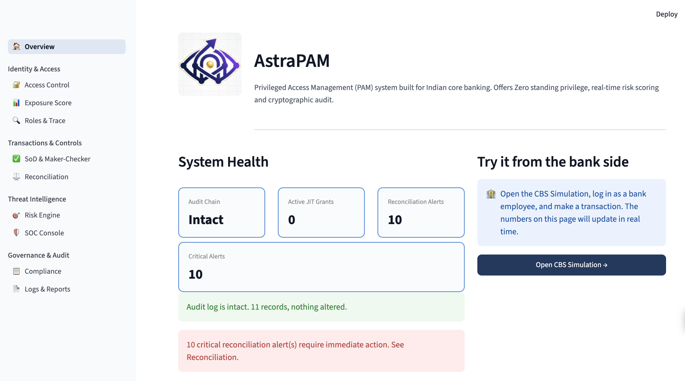

  

# AstraPAM

Zero-Standing-Privilege control plane for Indian core banking. Built to catch the class of insider fraud that behavioral analytics is structurally blind to.

## 🔗 Live Demo

  

| App | Link |
|---|---|
| AstraPAM Dashboard (Streamlit) | https://astrapam.streamlit.app/ |
| AstraPAM API (FastAPI) | https://astrapam.up.railway.app/ |
| CBS Simulation (Next.js) | https://cbs-simulation.vercel.app/ |

## 🚨 The Problem

Insider threats in banking come from employees, contractors, vendors, and admins acting maliciously, negligently, or under compromise. They are the hardest to detect because they already have legitimate access and their actions look normal on the surface.

Existing PAM and UEBA tools watch what people do. AstraPAM also watches what they are structurally capable of doing and what they should have done but never did.

## ✅ What AstraPAM Catches

AstraPAM is built to detect four distinct patterns of privileged access misuse, each tied to a documented Indian banking fraud.

- **Toxic entitlement conflicts:** One person holding two powers that should never coexist, like issuing and approving the same instrument. Caught structurally before any transaction happens.

- **Standing privilege exposure:** Access that sits idle and unmonitored because the person is not actively misusing it yet. High-privilege, low-activity identities are flagged before they are ever triggered.

- **Behavioral anomalies:** Off-hours logins, mass data exports, unusual system reach. Every session is scored in real time with SHAP attribution so every flag is explainable.

- **Missing financial records:** Privileged actions that were never entered into the core ledger. Every action is diffed against CBS and a missing entry raises an alert immediately.

**Controls at a glance:**

| Control | What it does |
|---|---|
| SoD Detection | Flags toxic entitlement pairs on one identity before any fraud occurs |
| JIT Access + Zero Standing Privilege | No persistent access. Every grant is ephemeral, scoped, TTL-bound, and risk-gated |
| Behavioral Risk Engine | LSTM autoencoder trained on CMU CERT dataset with SHAP attribution on every score |
| Ledger Reconciliation | Diffs every privileged action against CBS. No ledger entry within SLA raises a severity-tiered alert |
| Maker-Checker Dual Authorization | No single operator can approve their own actions. Enforced at API level, not just UI |
| Exposure Scoring | Ranks every user by structural damage potential based on entitlements, not behavior |
| Post-Quantum Cryptography | ML-KEM-768 + ML-DSA-65 on a hash-chained audit log (NIST FIPS 203/204) |
| Non-Human Identity Governance | Every service account, API key, and AI agent requires a named owner and expiry date |

## 🏗 Architecture

  

The platform is organized into four major sections: Identity & Access, Transactions & Controls, Threat Intelligence, and Governance & Audit. 

## 🛠 Tech Stack

| Layer | What we used |
|---|---|
| AstraPAM App | Streamlit (hosted on Streamlit Cloud) |
| API | FastAPI (hosted on Railway) |
| Risk Engine | PyTorch (LSTM autoencoder) + SHAP |
| Post-Quantum Crypto | pqcrypto (ML-KEM-768 + ML-DSA-65) |
| CBS Simulation | Next.js (hosted on Vercel) |
| Database | SQLite (14 tables) |
| Report Generation | NVIDIA NIM |

## 📋 Regulatory Alignment

| Control | Regulation |
|---|---|
| Least privilege, SoD, centralized auth | RBI Cyber Security Framework clause 8.4 |
| Real-time risk scoring and adaptive auth | RBI Authentication Directions (mandatory from April 2026) |
| Maker-checker dual authorization | Core Banking standard control |
| Post-quantum readiness and CBOM | RBI Q-SAFE Committee / Quantum Whitepaper |

Team Nachos · MIT License
