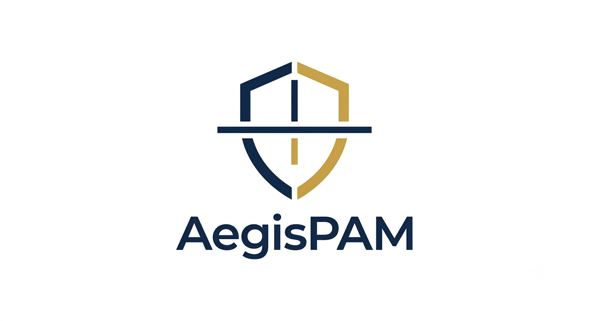
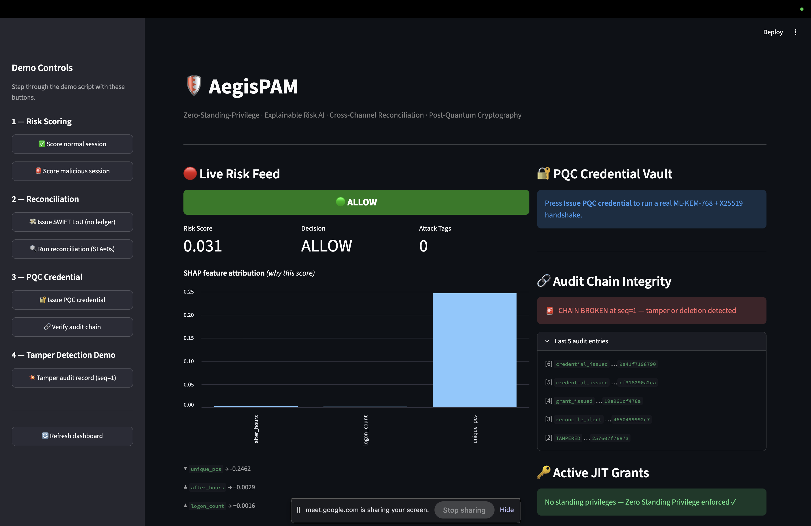
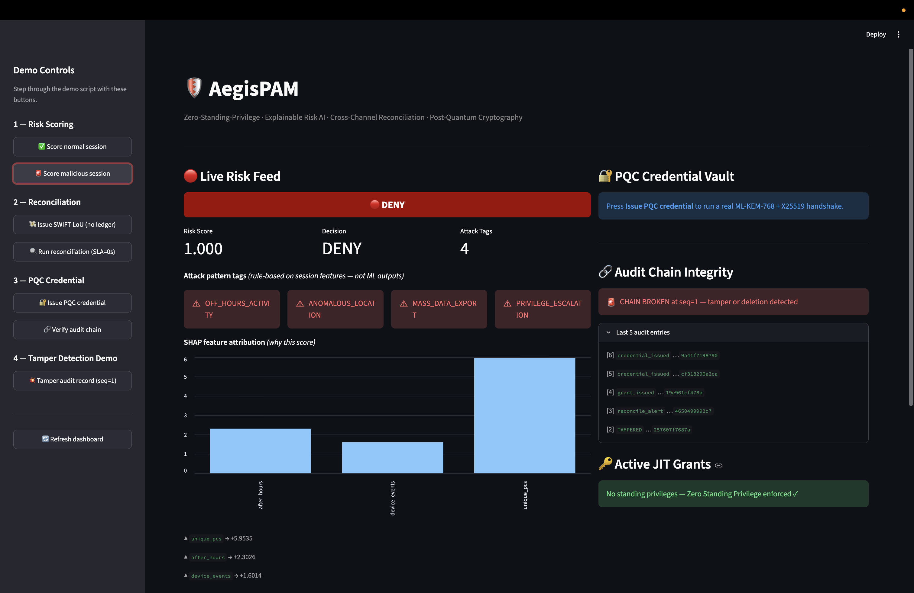
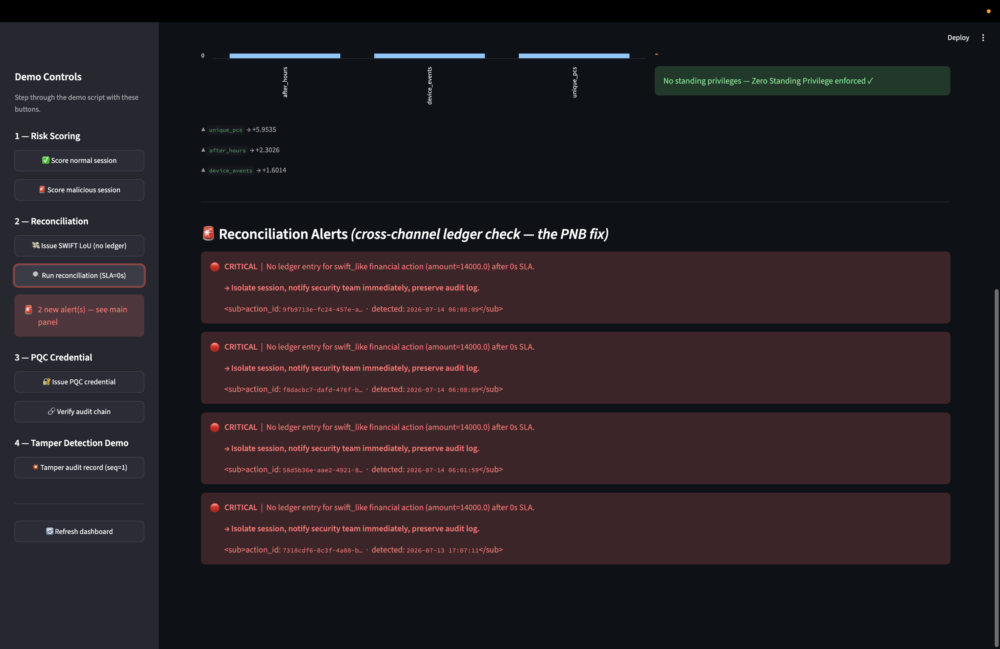

# 🛡️ AegisPAM

<p align="center">
  
</p>

<p align="center">
  <strong>Zero-Standing-Privilege Control Plane for Indian Banks</strong><br/>
  Catching the insider fraud that behavioral analytics is structurally blind to.
</p>

<p align="center">
  
  
  
</p>

<p align="center">
  <strong>FinSpark'26</strong> · Bank of Maharashtra × IBA × DFS × COEP Pune<br/>
  <em>Problem Statement 1 — Privileged Access Misuse & Insider Threat Detection</em>
</p>

---

## Overview

AegisPAM is a privileged access management platform built specifically for the structural gap that enabled the ₹14,000 crore PNB fraud — and that no existing PAM, UEBA, or SWIFT control can close.

It combines three independent detection layers into a single control plane:

- **Ledger reconciliation** — flags every privileged financial action that has no matching entry in the core-banking system, surfacing the exact fraud signature from the PNB case
- **Segregation-of-Duties enforcement** — catches the structural precondition (one identity holding conflicting entitlements like `ISSUE_LOU` + `APPROVE_LOU`) before any transaction occurs
- **Explainable behavioral risk scoring** — LSTM autoencoder trained on the CMU CERT Insider Threat dataset, with SHAP attribution so every score is auditable and defensible

Every artifact shares a single `correlation_id` threaded end-to-end from session through action, risk score, ledger alert, and audit record. One ID tells one complete story across the entire system.

---

## 🔥 The Back Story

In 2018, two employees at Punjab National Bank issued fraudulent Letters of Undertaking worth **₹14,000 crore** over **seven years** and nobody caught it.

**The fraudulent messages didn't look suspicious.** They looked like normal trade finance — no anomaly detector would have flagged them.

What made them fraudulent was something no behavioral model can see: **they never produced a matching entry in the core ledger.** The fraud signature was an *absence*, not an anomaly. The SWIFT channel sat architecturally *outside* the Core Banking System, so the money moved through a door the books never saw.

**AegisPAM detects that absence.** And goes one step further — it flags the *structural precondition* that made the fraud possible (one person holding both `ISSUE_LOU` and `APPROVE_LOU`) **before a single rupee moves.**

> Two independent lines of defence on the same failure mode:
> **Segregation-of-Duties detection catches the *precondition*. Ledger reconciliation catches the *act*.**

---

## 🎯 The Problem (and why current tools miss it)

| What the industry has | What it misses |
|---|---|
| **UEBA / behavioral analytics** flags *anomalous* behavior | PNB insiders behaved **normally**. They had legitimate authority. |
| **SWIFT Payment Controls** flags *outlier payments* within the SWIFT flow | The LoUs were **not outliers**. They looked routine. |
| **PAM vaults** rotate and store credentials | The insiders used **properly vaulted, authorized** credentials. |

Every existing control was looking at the transaction. None was looking for the transaction that wasn't there. That's the gap we built on.

---

## ✨ What AegisPAM Does

| # | Module | What it does | Why it matters |
|---|---|---|---|
| 🔁 | **Cross-Channel Ledger Reconciliation** | Diffs every privileged financial action against the core ledger. No matching entry inside the SLA window → severity-tiered alert + response playbook. | *₹14,000 Cr and 7 years at PNB. Caught here in 3 seconds.* |
| ⚖️ | **Segregation-of-Duties Detection** | SoD matrix flags toxic entitlement pairs *before* fraud occurs. `ISSUE_LOU` + `APPROVE_LOU` on one identity = `SOD-001 CRITICAL`, raised on day zero. | *Preventive, not just detective.* |
| 🧠 | **Explainable Behavioral Risk Engine** | LSTM Autoencoder on the CMU CERT dataset. Reconstruction error → risk score. SHAP explains every decision + named attack tags (`OFF_HOURS_ACTIVITY`, `MASS_DATA_EXPORT`, …). | *No black boxes — every score is defensible to a regulator.* |
| 🎚️ | **Graduated Risk-Adaptive Access** | Zero Standing Privilege. Grants are just-in-time, scoped, TTL-bound, auto-revoked. Decisions: `allow → throttle → step_up → deny`. | *No standing privilege. Ever.* |
| 📊 | **Blind-Spot Quadrant** | Two orthogonal scores: **Behavioral Risk** (what you *did*) × **Standing Exposure** (what you *could* do). The 2×2 surfaces users who look safe behaviorally but carry structural danger. | *Top-left quadrant = PNB for 7 years.* |
| 🚨 | **SOC Mitigation Console** | One-click freeze / block / unblock / hold / revoke-session / require-step-up. All console actions are maker-checker'd and written to the signed audit chain. | *Who watches the watchmen? The chain does.* |
| 🔐 | **Post-Quantum Cryptography** | ML-KEM-768 (FIPS 203) hybrid KEM + ML-DSA-65 (FIPS 204) on a hash-chained audit log. Real artifact sizes on screen — proof the KEM ran. CBOM scanner flags quantum-vulnerable calls. | *Harvest-Now-Decrypt-Later is a present-day risk.* |
| 🤖 | **Non-Human Identity Governance** | Service accounts and AI-agent credentials with named owners, mandatory expiry, and auto-revocation. | *Machine identities outnumber humans 82:1 — and they bypass MFA.* |

---

## 🖥️ Screenshots

<table>
  <tr>
    <td align="center"><strong>Risk Engine — Normal Session</strong></td>
    <td align="center"><strong>Risk Engine — Malicious Session</strong></td>
  </tr>
  <tr>
    <td></td>
    <td></td>
  </tr>
  <tr>
    <td align="center" colspan="2"><strong>Reconciliation Alert</strong></td>
  </tr>
  <tr>
    <td colspan="2" align="center"></td>
  </tr>
</table>

---

## 🏗️ Architecture

<p align="center">
  
</p>

**Design principle: contract-first.** Every module boundary is a Pydantic schema defined *once* in `schemas.py`. A single `correlation_id` is generated at session start and threaded through **every** artifact — session → action → ledger → risk → alert → console response → audit record.

**That means one ID tells one complete story across the entire system.**

---

## 🧱 Tech Stack

| Layer | Technology | Why |
|---|---|---|
| **API** | FastAPI (Python 3.12+) | Async, Pydantic v2 validation at every boundary |
| **ML** | PyTorch (LSTM Autoencoder) + SHAP + imbalanced-learn | Unsupervised — fits insider-threat label scarcity |
| **Crypto** | `pqcrypto` — ML-KEM-768 + ML-DSA-65 | NIST FIPS 203/204 standards. Never hand-rolled. |
| **Data** | SQLite | Zero-setup, fully local |
| **Dashboard** | Streamlit (multipage) | Live UI without a JS toolchain |
| **Dataset** | CMU CERT Insider Threat r4.2 | Public academic benchmark — results are comparable |

---

## 🚀 Quickstart

```bash
git clone https://github.com/smilewithkhushi/AegisPAM
cd AegisPAM

python -m venv .venv && source .venv/bin/activate   # Windows: .venv\Scripts\activate
pip install -r requirements.txt

cp .env.example .env          # no secrets required for local demo

./script.sh                   # starts mock CBS, control API, and dashboard in one go
```

Open **http://localhost:8501** 🎉

---

## 🎬 The Demo — "The Gokulnath Shetty Path"

Follow one identity through the entire system. *(Named after the PNB deputy manager at the centre of the 2018 fraud.)*

| # | Step | What you see |
|---|---|---|
| **1** | **SoD scan** | 🚨 `user_007` (Branch Manager @ SOL003) holds **`ISSUE_LOU` + `APPROVE_LOU`** → **CRITICAL `SOD-001`**. *The PNB precondition — flagged before anything happens.* |
| **2** | **He acts anyway** | Issues an out-of-band LoU through the SWIFT-like channel at 02:14. |
| **3** | **No ledger entry** | 🔴 Reconciliation fires: **CRITICAL — privileged financial action with no matching ledger entry.** |
| **4** | **The AI explains** | Risk `0.87` → SHAP: off-hours (+0.31), first-time channel (+0.29), amount vs. peer baseline (+0.27). Tags: `OFF_HOURS_ACTIVITY`, `PRIVILEGE_ESCALATION`. |
| **5** | **One-click mitigation** | ❄️ Operator hits **FREEZE**. Next access request → **denied**. A permanent BLOCK requires a **second approver** — self-approval is rejected. |
| **6** | **Tamper-proof** | ✍️ Every step is ML-DSA-signed. Edit one historical record → `verify_chain()` breaks at that exact sequence number. |
| **7** | **The blind spot** | 📊 On the 2×2, `user_007` sits **top-left**: high standing exposure, *normal* behavior. **Where PNB lived for seven years.** |

**Click any `correlation_id` in the trace view to replay the whole chain.**

---

## 📐 Aligned to Indian Banking Regulation

Every control maps to something RBI already requires:

| Control | Regulation |
|---|---|
| Centralized auth, least privilege, separation of duties | **RBI Cyber Security Framework, cl. 8.4** |
| Dormant-account & abnormal-logon detection | **RBI cl. 8.6 / 8.7** |
| Board-approved IT risk framework, 6-hour incident reporting | **RBI Master Directions on IT Governance (2024)** |
| Real-time transaction-level risk scoring + adaptive authentication | **RBI Authentication Directions — mandatory from 1 April 2026.** Banks are now liable for authentication *design* failures, not just breaches. |
| Post-quantum readiness, Cryptographic Bill of Materials | **RBI Q-SAFE Committee / Quantum Whitepaper** |
| Maker-checker dual authorization | **Core Banking standard control** |

> ⚡ **The urgency:** RBI made real-time risk scoring and adaptive auth **mandatory three months ago**. AegisPAM is a direct implementation of a control banks are now *legally liable* for.

---

## 👥 Team

**Khushi Panwar** and **Vaishnavi** — COEP Pune, FinSpark'26.

---

## 📄 License

MIT — see [LICENSE](LICENSE).
